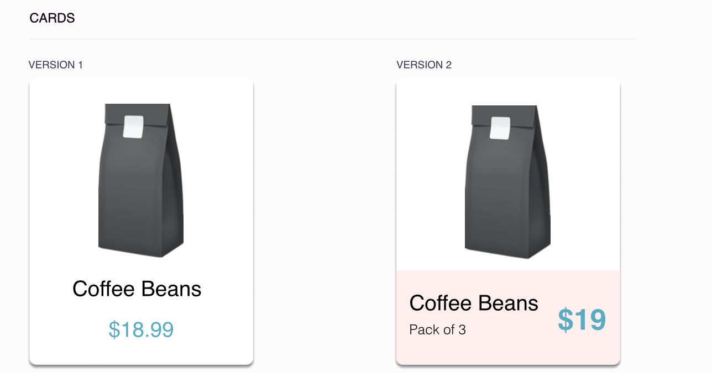
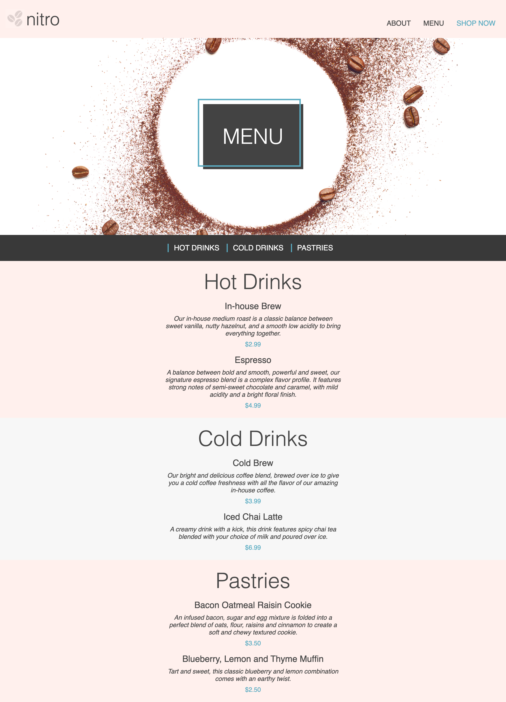
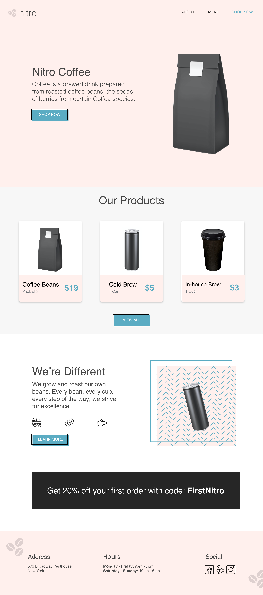

# 5. Coffee Shop: Update Card Component

With your knowledge surrounding the use of Flexbox, update your card component to resemble the second version found on the style guide.

Include your updated card component in your Coffee Shop landing page.

## Menu

Using the Box Model and display property, update the Nitro Coffee menu to match the following mockup. This mockup does not provide exact spacing values, however work to the best of your abilities to closely resemble the mockup.

##  

# 6. Coffee Shop: Page Layout Using Flexbox

##  Menu
Referencing this mockup, use Flexbox to update the hero section to place the menu title in the center of the hero image and to update the main navigation bar.

##  Landing Page
Referencing this mockup, update the discount section (located under the card section) using Flexbox to create the proper layout.

## 

# 7. Coffee Shop: Positioning

##  Menu

Referencing this mockup, use absolute and relative positioning to add the detail box around the menu heading.

## 

##  Landing Page

Referencing this mockup, update the following components:

*   Three teal buttons
*   "We're Different" section
    *   Image Box detail
*   Footer
    *   Coffee bean images

## 

