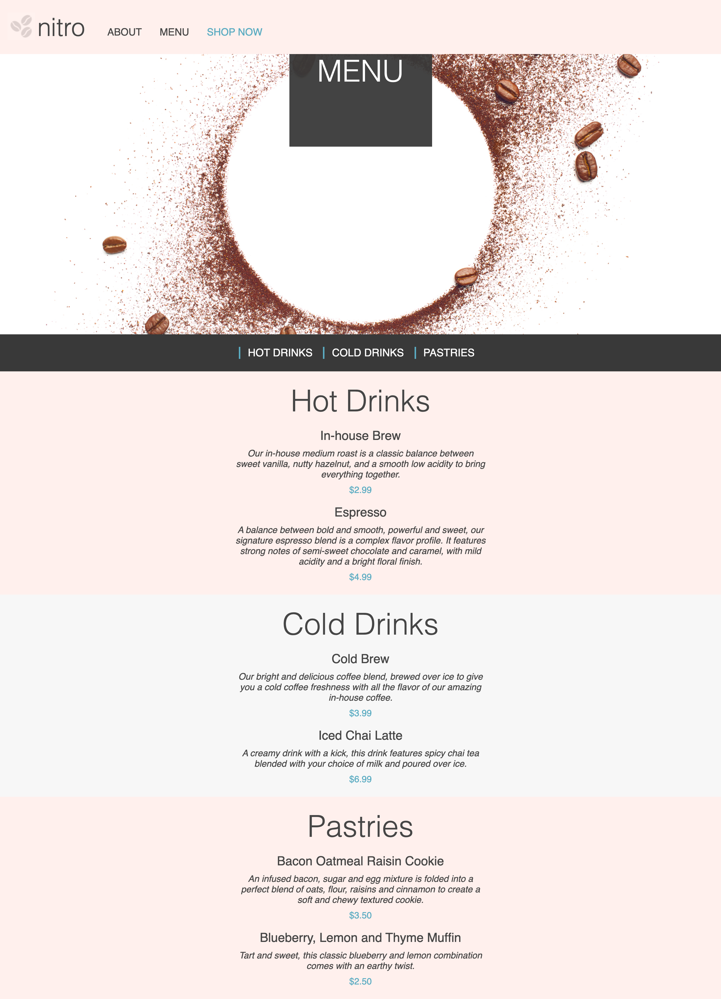
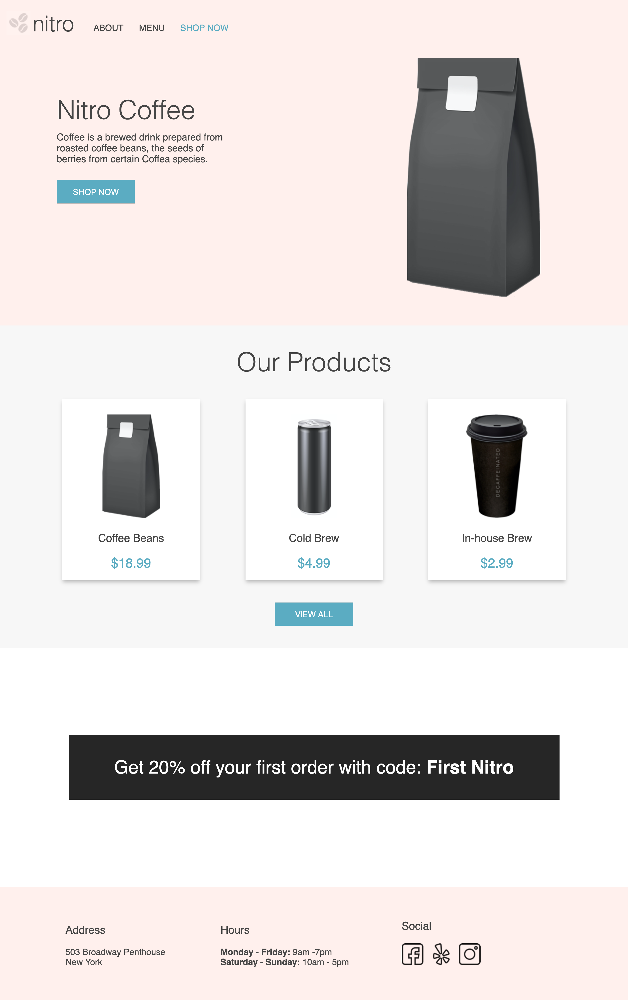

# 3. Coffee Shop: Menu Layout

The flow of information on a website is key to communicate effectively to your users. The combination of the Box Model and CSS display property gives developers the ability to layout HTML elements in a meaningful way.

You can think of the box model as the ability to control the space an element should take up. The display property determines how an element is displayed and can be used as a means of controlling its layout in relation to other elements.

## Menu

Using the Box Model and display property, update the Nitro Coffee menu to match the following mockup. This mockup does not provide exact spacing values, however work to the best of your abilities to closely resemble the mockup.

##  

# 4. Coffee Shop: Card Component

Looking at the landing page for our Coffee Shop, can you identify some components throughout the site?

Using the style guide provided, create the proper HTML and CSS for the version 1 card component.

Remember to create reusable CSS and use the BEM methodology

## 

